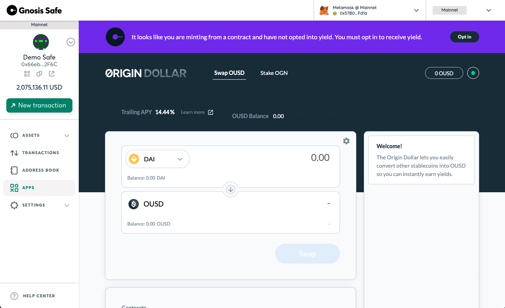

# Rebasing & Smart Contracts

If you are using a multi-sig wallet or another smart contract that wishes to participate in the rebasing aspect of OUSD or OETH you must call the`rebaseOptIn()` function. This only applies to smart contracts as standard EOA wallets are enrolled automatically.


Multi-sig wallets or other smart contracts must call`rebaseOptIn()`to earn yield.


By default, OUSD or OETH that is held on smart contracts will not participate in the rebasing nature of the token and will forfeit any yield unless the smart contract explicitly opts-in. This increases the composability of these coins within DeFi as many protocols weren't designed with the expectation that balances might change. To other DeFi protocols, OUSD and OETH work just like any other normal, well-behaved ERC-20 until you ask it to change. This is a particularly useful attribute for automated market makers (AMM’s) like Uniswap which break when the number of tokens they are holding changes unexpectedly.

Smart contracts must explicitly opt-in to receiving yield via the rebasing mechanism. This fixes the issue with the expanding supply on AMM’s while still allowing multi-sig wallets and other smart contracts the opportunity to still participate and earn yield.&#x20;

With the launch of OETH in May 2023, OGV governance will be able to vote for specific addresses to receive yield. This will allow for future integrations (eg. leverage on Aave) with other DeFi protocols that have immutable contracts or are otherwise unable to opt-in to yield themselves.  &#x20;


If you are deploying a contract and intend to call`rebaseOptIn()`to earn yield you cannot call it from the contract's constructor. The contract must be deployed before it can be called.


[Gnosis Safe](https://gnosis-safe.io/) users are encouraged to use the Origin Dollar and Origin Ether apps which will prompt you to opt-in to receiving yield. If you are using the "Old" [Gnosis Wallet](https://github.com/gnosis/MultiSigWallet) or another contract-based wallet, you will need the [proxy contract address](../../smart-contracts/registry.md) and the corresponding [ABI](https://api.etherscan.io/api?module=contract\&action=getabi\&address=0x1ae95dd4eeae7ed03da79856c2d44ffa3318f805). Once you add those, you will be able to call the `rebaseOptIn()` function to opt into receiving yield via rebasing or`rebaseOptOut()` to turn it off again.
