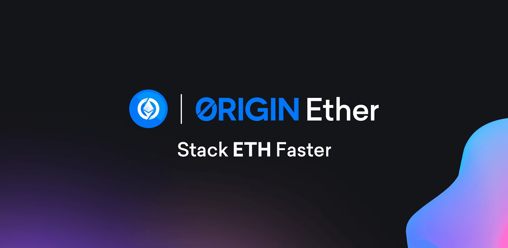

# Origin Ether (OETH)

<figure><figcaption></figcaption></figure>

Origin Ether shares much of its codebase with Origin Dollar, with the key distinction being that OETH is an ether-denominated token, whereas OUSD is denominated in USD. OETH takes advantage of liquid staking yield, boosting APYs through DeFi strategies and rewards tokens.&#x20;

Ethereum staking participation currently pales in comparison to Solana (68% staked), Cardano (72% staked), Polkadot (46% staked), and Avalanche (62% staked). This is largely due to stakers being unable to withdraw staked ETH up until the recent Shanghai upgrade. Of the 15% of Ether staked, around 40% is provided through LST providers like Lido, Coinbase, Frax, and others.

With Ethereum’s Shanghai upgrade removing withdrawal risk, ETH staking participation is expected to increase dramatically. With a total addressable market of all ether in circulation, the ETH staking market is in its infancy. With ETH staking withdrawals being enabled, staking participation is projected to double in the next 12 months ([Delphi Digital](https://members.delphidigital.io/reports/the-future-of-eth-liquid-staking#the-future-of-eths-liquid-staking-protocols)). Over the long-term, it’s not inconceivable that 60-75% of ether will be staked to secure the network.

In addition, LSTs will become more liquid and have far less depegging risk going forward. They will be used even more broadly as DeFi primitives and money legos. However, liquid staking is a highly concentrated sector, with just a few players dominating the market. Lido currently dominates the LST market with 75% market share, followed by distant second and third players Coinbase and Rocket Pool. This presents single points of failure for Ethereum’s network, becoming increasingly more of a threat as regulators crack down on digital asset staking.

As an ETH staker, it is therefore prudent to spread ETH staked across a variety of diverse staking strategies or LSTs. Further, as the market continues to fragment with new entrants, there are opportunities to earn more competitive yields by using LSTs that are also offering additional yield like liquidity provisioning incentives. OETH tackles both the diversification and yield optimization challenges elegantly by providing holders with an easy, passive way to earn higher yield with exposure to numerous LSTs.&#x20;

\
Origin Ether earns yield from liquid staking tokens stETH, rETH, and sfrxETH. Holders earn superior yield with Origin Ether, as APYs are optimized between LSTs and liquidity provision strategies within DeFi. At launch, OETH utilizes an AMO strategy on Curve and Convex through the OETH-ETH pool. In doing so, Origin Ether accrues heightened trading fees and rewards tokens on top of validator rewards from the aforementioned LSTs.&#x20;
