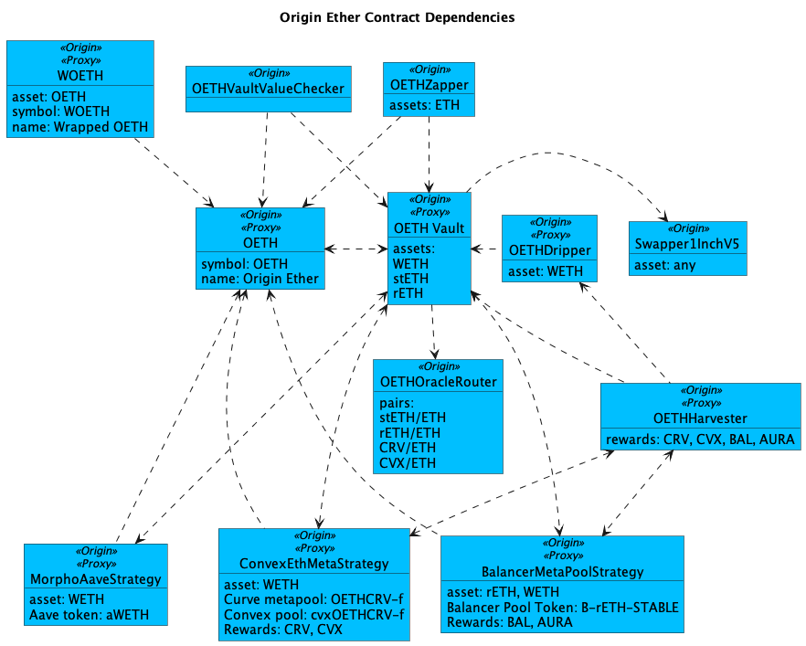

# OETH Registry

Most of Origin's contracts are upgradable via a well-known proxy wrapper and an implementation contract. The Vault is split into VaultAdmin and VaultCore to work around the maximum contract size limit on Ethereum

<figure><figcaption></figcaption></figure>

**OETH Core**

<table><thead><tr><th width="190">Contract</th><th width="633">Address</th></tr></thead><tbody><tr><td>OETH Token</td><td>0x856c4Efb76C1D1AE02e20CEB03A2A6a08b0b8dC3</td></tr><tr><td>wOETH Token</td><td>0xDcEe70654261AF21C44c093C300eD3Bb97b78192</td></tr><tr><td>OETH Vault</td><td> 0x39254033945AA2E4809Cc2977E7087BEE48bd7Ab</td></tr><tr><td>OETH Zapper</td><td>0x9858e47BCbBe6fBAC040519B02d7cd4B2C470C66</td></tr></tbody></table>

**OETH Strategies**

<table><thead><tr><th width="276">Contract</th><th>Address</th></tr></thead><tbody><tr><td>OETH Convex ETH+OETH (AMO)</td><td>0x1827F9eA98E0bf96550b2FC20F7233277FcD7E63</td></tr><tr><td>OETH Frax Staking</td><td>0x3fF8654D633D4Ea0faE24c52Aec73B4A20D0d0e5</td></tr></tbody></table>

**OETH Yield Harvesting & Rewards Distribution**

<table><thead><tr><th width="194">Contract</th><th>Address</th></tr></thead><tbody><tr><td>OETH Harvester</td><td>0x0D017aFA83EAce9F10A8EC5B6E13941664A6785C</td></tr><tr><td>OETH Dripper</td><td>0xc0F42F73b8f01849a2DD99753524d4ba14317EB3</td></tr><tr><td>OETH Buyback</td><td>Not yet live</td></tr></tbody></table>

**OETH Assets**

OETH is backed by WETH and the following liquid staking derivates:

<table data-header-hidden><thead><tr><th width="183"></th><th></th></tr></thead><tbody><tr><td>WETH</td><td>0xc02aaa39b223fe8d0a0e5c4f27ead9083c756cc2</td></tr><tr><td>Lido stETH</td><td>0xae7ab96520de3a18e5e111b5eaab095312d7fe84</td></tr><tr><td>Rocketpool rETH</td><td>0xae78736cd615f374d3085123a210448e74fc6393</td></tr><tr><td>Frax frxETH</td><td>0x5e8422345238f34275888049021821e8e08caa1f</td></tr></tbody></table>

**Oracles**

The following Chainlink oracles are used to protect the vault in case a backing asset loses value. They also offer slippage protection when harvesting rewards tokens.

<table><thead><tr><th width="181">Pair</th><th>Contract</th></tr></thead><tbody><tr><td><a href="https://data.chain.link/ethereum/mainnet/crypto-eth/steth-eth">stETH/ETH</a></td><td>0x86392dc19c0b719886221c78ab11eb8cf5c52812</td></tr><tr><td><a href="https://data.chain.link/ethereum/mainnet/crypto-eth/reth-eth">rETH/ETH</a></td><td>0x536218f9e9eb48863970252233c8f271f554c2d0</td></tr><tr><td><a href="https://data.chain.link/ethereum/mainnet/crypto-usd/crv-usd">CRV/USD</a></td><td>0xcd627aa160a6fa45eb793d19ef54f5062f20f33f</td></tr><tr><td><a href="https://data.chain.link/ethereum/mainnet/crypto-usd/cvx-usd">CVX/USD</a></td><td>0xd962fC30A72A84cE50161031391756Bf2876Af5D</td></tr></tbody></table>
